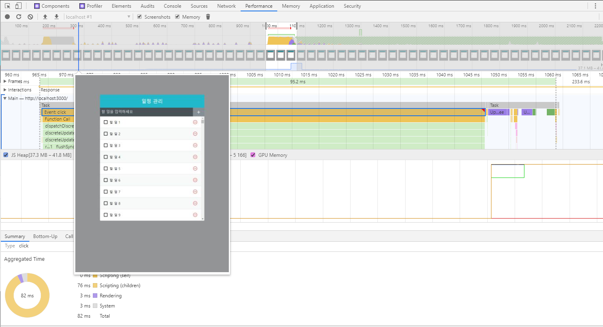

<h1>before<h1>

 
  <h3>느려지는 원인분석</h3>
  1. 전달받은 props 변경시  
  2. state 변경시  
  3. 부모 component가 rerendering시  
  4. forceUpdate 함수 실행시  
  
   
  
  '할 일1'의 경우, state가 변경되어 부모 component가 rerendering되어 해당 항목이 rerendering되는 것은 맞지만,  
  '할 일2' ~ '할 일2500'은 불필요한 rerendering됨  
  
  => 성능 최적화 필요
  
  
  <h1>after<h1>
    
  
